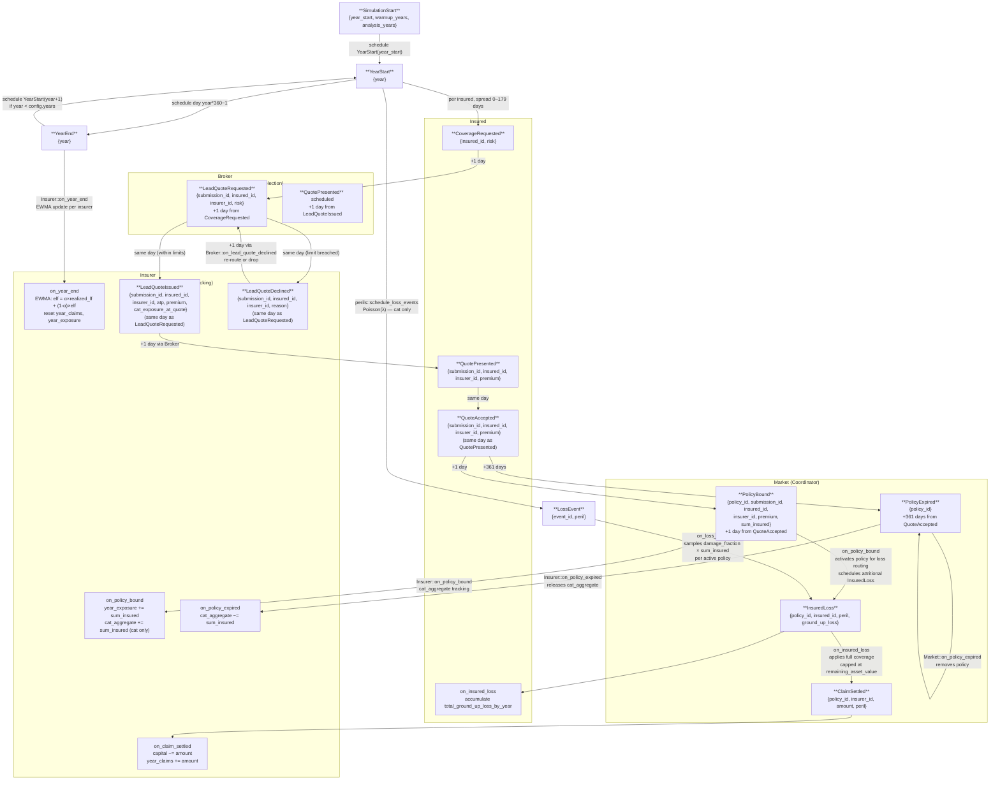

# Event Flow Diagram

End-to-end flow of all event types through the discrete-event simulation.
Time advances by pulling the lowest-timestamp event from a min-heap priority queue.



## Legend

| Shape | Meaning |
|-------|---------|
| Rectangle | Active event type — fires and produces downstream events |
| Rounded rectangle | Terminal state — no further events produced |
| Label on arrow | Side-effect or scheduling condition |

## Event index

| # | Event | Producer | Consumer | Day offset | market-mechanics.md |
|---|-------|----------|----------|------------|---------------------|
| 1 | `SimulationStart { year_start, warmup_years, analysis_years }` | `Simulation::start()` | `Simulation::dispatch` → schedule `YearStart`; metadata read by analysis scripts to skip warm-up years | Day 0 | — |
| 2 | `YearStart { year }` | `SimulationStart` handler / `YearEnd` handler | `Simulation::handle_year_start`: endow capital, schedule `CoverageRequested` per insured, schedule cat, schedule `YearEnd` | `(year-1) × 360` | §7 Capital & Solvency |
| 3 | `YearEnd { year }` | `YearStart` handler | `Simulation::handle_year_end`: call `Insurer::on_year_end` (EWMA update + YTD reset), schedule next `YearStart` | `year × 360 − 1` | §4.1 Actuarial channel, §8.2 Coordinator Statistics |
| 4 | `CoverageRequested { insured_id, risk }` | `YearStart` handler | `Broker::on_coverage_requested` → emit `LeadQuoteRequested` | spread days 0–179 of year | §5 Placement |
| 5 | `LeadQuoteRequested { submission_id, insured_id, insurer_id, risk }` | `Broker` | `Insurer::on_lead_quote_requested` → emit `LeadQuoteIssued` | +1 from `CoverageRequested` | §5 Placement, §4.1 Actuarial channel |
| 6 | `LeadQuoteIssued { submission_id, insured_id, insurer_id, atp, premium, cat_exposure_at_quote }` | `Insurer` | `Broker::on_lead_quote_issued` → emit `QuotePresented` | same day as `LeadQuoteRequested` | §4 Pricing, §5 Placement |
| 6b | `LeadQuoteDeclined { submission_id, insured_id, insurer_id, reason }` | `Insurer` | `Broker::on_lead_quote_declined` → emit `LeadQuoteRequested` to next insurer (or drop if all declined) | same day as `LeadQuoteRequested` | §4 Pricing, §5 Placement |
| 7 | `QuotePresented { submission_id, insured_id, insurer_id, premium }` | `Broker` | `Insured::on_quote_presented` → emit `QuoteAccepted` | +1 from `LeadQuoteIssued` | §5 Placement |
| 8 | `QuoteAccepted { submission_id, insured_id, insurer_id, premium }` | `Insured` | `Market::on_quote_accepted` → create `BoundPolicy` (pending), emit `PolicyBound` + `PolicyExpired` | same day as `QuotePresented` | §5 Placement, §2.2 Annual policy terms |
| 9 | `QuoteRejected { submission_id, insured_id }` | `Insured` (not fired in this model) | `Market::on_quote_rejected` (no-op) | same day as `QuotePresented` | §5 Placement |
| 10 | `PolicyBound { policy_id, submission_id, insured_id, insurer_id, premium, sum_insured }` | `Market` | `Market::on_policy_bound` (activate policy) + `perils::schedule_attritional_claims_for_policy` + `Insurer::on_policy_bound` (cat aggregate tracking) | +1 from `QuoteAccepted` | §2.2 Annual policy terms, §1.3 Attritional occurrences |
| 11 | `PolicyExpired { policy_id }` | `Market::on_quote_accepted` | `Insurer::on_policy_expired` (release cat aggregate) + `Market::on_policy_expired` (remove policy) | +361 from `QuoteAccepted` (= +360 from `PolicyBound`) | §2.2 Annual policy terms |
| 12 | `LossEvent { event_id, peril }` | `perils::schedule_loss_events` at `YearStart` | `Market::on_loss_event` → emit `InsuredLoss` per active policy | Poisson-scheduled within year | §1.3 Occurrences, §1.2 Catastrophe peril class |
| 13 | `InsuredLoss { policy_id, insured_id, peril, ground_up_loss }` | `Market` (cat) / `perils` (attritional) | `Insured::on_insured_loss` (GUL tracking) + `Market::on_insured_loss` → emit `ClaimSettled` | same day as trigger | §1.3 GUL, §2.1 Policy terms, §6 Loss Settlement |
| 14 | `ClaimSettled { policy_id, insurer_id, amount, peril }` | `Market` | `Insurer::on_claim_settled` (capital deduction) | same day as `InsuredLoss` | §6 Loss Settlement, §7.2 Insolvency |

## Day offsets

- `CoverageRequested` → `LeadQuoteRequested`: **+1 day**
- `LeadQuoteRequested` → `LeadQuoteIssued`: **same day**
- `LeadQuoteIssued` → `QuotePresented`: **+1 day**
- `QuotePresented` → `QuoteAccepted`: **same day**
- `QuoteAccepted` → `PolicyBound`: **+1 day**
- Total `CoverageRequested` → `PolicyBound`: **3 days**
- `QuoteAccepted` → `PolicyExpired`: **+361 days** (= 360 days of coverage from `PolicyBound`)
- `LossEvent` → `InsuredLoss` → `ClaimSettled`: **same day**
- Attritional `InsuredLoss`: Poisson-scheduled strictly after `PolicyBound` day, within policy year

## Damage fraction model

`LossEvent` carries no severity field. When a `LossEvent` fires, `Market::on_loss_event`
samples a **damage fraction** from `DamageFractionModel` for each active (bound) policy:

```
ground_up_loss = damage_fraction × sum_insured   (naturally ≤ sum_insured)
```

The damage fraction is drawn from per-peril `DamageFractionModel` distributions
(LogNormal for attritional, Pareto for cat), clipped to [0.0, 1.0]. Full coverage is applied
in `Market::on_insured_loss`:

```
effective_gul = min(ground_up_loss, remaining_asset_value[policy, year])
→ ClaimSettled(amount = effective_gul)
```

Aggregate annual GUL per (policy, year) is capped at `sum_insured`.

## Policy activation invariant

A policy is **only loss-eligible after `PolicyBound` fires**:

1. `QuoteAccepted` → `Market::on_quote_accepted`: creates `BoundPolicy` in `pending_policies`; updates `ytd_premiums`; schedules `PolicyBound` and `PolicyExpired`.
2. `PolicyBound` → `Market::on_policy_bound`: moves policy from `pending_policies` to `policies`; registers in `insured_active_policies`. Only after this call does `on_loss_event` see the policy.
