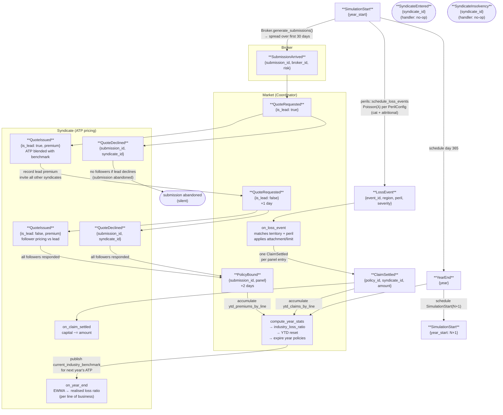

# Event Flow Diagram

End-to-end flow of all event types through the discrete-event simulation.
Time advances by pulling the lowest-timestamp event from a min-heap priority queue.

## Legend

| Shape | Meaning |
|-------|---------|
| Rectangle | Active event type — fires and produces downstream events |
| Rounded rectangle | Terminal state — no further events produced |
| Label on arrow | Side-effect or scheduling condition |

## Event index

| # | Event | Producer | Consumer |
|---|-------|----------|----------|
| 1 | `SimulationStart` | `handle_year_end` / external seed | `Simulation::handle_simulation_start` |
| 2 | `YearEnd` | `handle_simulation_start` | `Simulation::dispatch` → `Market::compute_year_stats`, `Syndicate::on_year_end`, `Broker::on_year_end`, `Market::expire_policies` |
| 3 | `SubmissionArrived` | `Broker::generate_submissions` | `Market::on_submission_arrived` |
| 4 | `QuoteRequested` | `Market::on_submission_arrived`, `Market::on_lead_quote_issued` | `Syndicate::on_quote_requested` |
| 5 | `QuoteIssued` | `Syndicate::on_quote_requested` | `Market::on_lead_quote_issued` / `Market::on_follower_quote_issued` |
| 6 | `QuoteDeclined` | `Syndicate::on_quote_requested` | `Market::on_quote_declined` |
| 7 | `PolicyBound` | `Market::assemble_panel` (+2 days) | `Market::on_policy_bound` (registers policy, YTD premium) |
| 8 | `LossEvent` | `handle_simulation_start` via `perils::schedule_loss_events` (Poisson frequency-severity) | `Market::on_loss_event` |
| 9 | `ClaimSettled` | `Market::on_loss_event` | `Syndicate::on_claim_settled` + `Market::on_claim_settled` (YTD) |
| 10 | `SyndicateEntered` | — | no-op |
| 11 | `SyndicateInsolvency` | — | no-op |

## Day offsets

- `SubmissionArrived` → `QuoteRequested` (lead): **same day**
- Lead `QuoteIssued` → `QuoteRequested` (followers): **+1 day**
- Last follower response → `PolicyBound`: **+2 days**
- `LossEvent` → `ClaimSettled`: **same day**
- `SimulationStart` → `YearEnd`: **day 365 of that year**
- `YearEnd` → next `SimulationStart`: **day 1 of next year**
