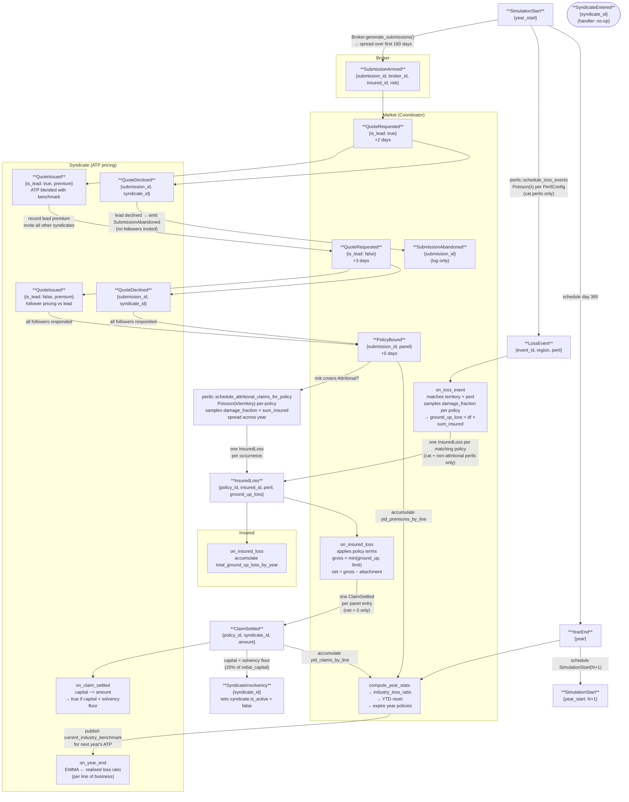

# Event Flow Diagram

End-to-end flow of all event types through the discrete-event simulation.
Time advances by pulling the lowest-timestamp event from a min-heap priority queue.



## Legend

| Shape | Meaning |
|-------|---------|
| Rectangle | Active event type — fires and produces downstream events |
| Rounded rectangle | Terminal state — no further events produced |
| Label on arrow | Side-effect or scheduling condition |

## Event index

| # | Event | Producer | Consumer |
|---|-------|----------|----------|
| 1 | `SimulationStart` | `handle_year_end` / external seed | `Simulation::handle_simulation_start` |
| 2 | `YearEnd` | `handle_simulation_start` | `Simulation::dispatch` → `Market::compute_year_stats`, `Syndicate::on_year_end`, `Broker::on_year_end`, `Market::expire_policies` |
| 3 | `SubmissionArrived` {submission_id, broker_id, insured_id, risk} | `Broker::generate_submissions` | `Market::on_submission_arrived` |
| 4 | `QuoteRequested` | `Market::on_submission_arrived` (+2 days), `Market::on_lead_quote_issued` (+3 days) | `Syndicate::on_quote_requested` |
| 5 | `QuoteIssued` | `Syndicate::on_quote_requested` | `Market::on_lead_quote_issued` / `Market::on_follower_quote_issued` |
| 6 | `QuoteDeclined` | `Syndicate::on_quote_requested` | `Market::on_quote_declined` |
| 7 | `SubmissionAbandoned` | `Market::on_quote_declined` (when lead declines) | none (log only) |
| 8 | `PolicyBound` | `Market::assemble_panel` (+5 days from last follower response) | `Market::on_policy_bound` (registers policy, YTD premium); `perils::schedule_attritional_claims_for_policy` (if risk covers Attritional, emits `InsuredLoss`) |
| 9 | `LossEvent` | `handle_simulation_start` via `perils::schedule_loss_events` (Poisson frequency, **cat perils only**; no severity field) | `Market::on_loss_event` → samples `damage_fraction` per policy → emits `InsuredLoss` |
| 10 | `InsuredLoss` {policy_id, insured_id, peril, ground_up_loss} | `Market::on_loss_event` (cat perils) or `perils::schedule_attritional_claims_for_policy` (Attritional, per-policy) | `Insured::on_insured_loss` (accumulate stats) + `Market::on_insured_loss` → applies policy terms → emits `ClaimSettled` |
| 11 | `ClaimSettled` | `Market::on_insured_loss` | `Syndicate::on_claim_settled` + `Market::on_claim_settled` (YTD) |
| 12 | `SyndicateEntered` | — | no-op |
| 13 | `SyndicateInsolvency` | `Syndicate::on_claim_settled` (when capital < solvency floor) | `Simulation::dispatch` → sets `syndicate.is_active = false` |

## Day offsets

- `SubmissionArrived` → `QuoteRequested` (lead): **+2 days**
- Lead `QuoteIssued` → `QuoteRequested` (followers): **+3 days**
- Last follower response → `PolicyBound`: **+5 days**
- Total submission-to-bind cycle: **~10 days**
- `SubmissionArrived` spread: **first 180 days** of each year (~4–5 submissions/day)
- `LossEvent` → `InsuredLoss` → `ClaimSettled`: **same day** (no offset)
- Attritional `InsuredLoss`: spread across year days (Poisson per-policy)
- `SimulationStart` → `YearEnd`: **day 365 of that year**
- `YearEnd` → next `SimulationStart`: **day 1 of next year**

## Damage fraction model

`LossEvent` no longer carries a `severity` field. Instead, when a `LossEvent` fires,
`Market::on_loss_event` samples a **damage fraction** from `DamageFractionModel` for
each matching policy:

```
ground_up_loss = damage_fraction × sum_insured   (naturally ≤ sum_insured)
```

The damage fraction is drawn from per-peril `DamageFractionModel` distributions
(LogNormal or Pareto, clipped to [0.0, 1.0]). Policy terms are applied in
`Market::on_insured_loss`:

```
gross = min(ground_up_loss, limit)
net   = gross − attachment
→ ClaimSettled per panel entry  (if net > 0)
```

Attritional claims follow the same path: `schedule_attritional_claims_for_policy`
emits `InsuredLoss` events (not `ClaimSettled` directly).
